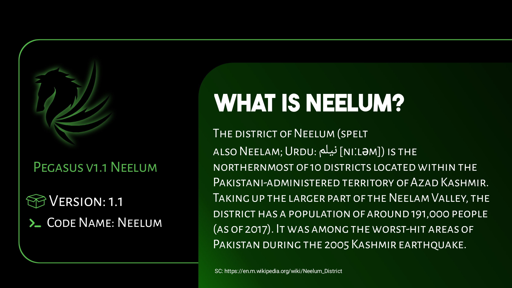

# Project_SuseLTS

Don't Reedit without admin permission!.

# Installations

- Download pegasus file minimal or full edition(For now Minimal only).
- Download Pegasus-Term aplication.
- Open Pegasus-Term apllication then allow file permissions
- Choose Local Install click Three point And Find pegasus.zip file
- Then click "ok"
- Wait until the installation is complete.
- Delete recent Pegasus-Term then Open again.

# Enjoy!!!!
